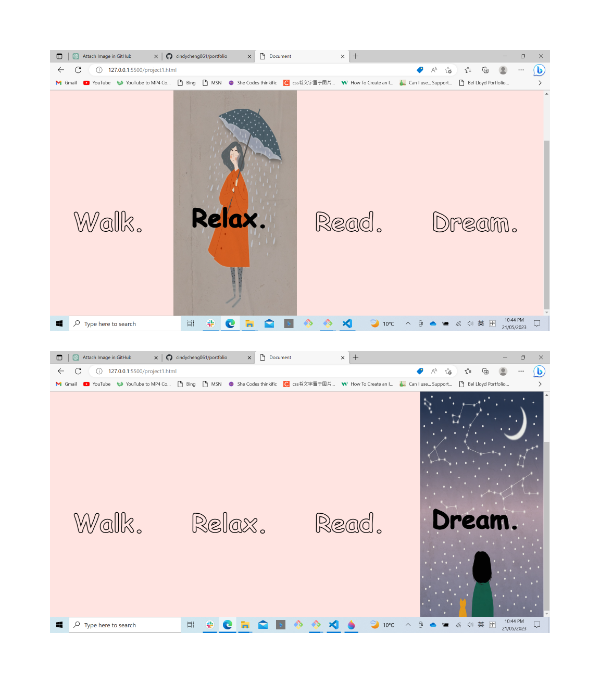

# Design Brief

# {{ Xiaoxin(Cindy) CHENG}} - Portfolio Task

[My portfolio site]({{https://github.com/cindycheng061/portfolio}})

## Project Requirements###

# Content{{ Add a short paragraph describing the features below. }}

- [x] At least one profile picture
- [x] Biography (at least 100 words)
- [x] Functional Contact Form
- [x] "Projects" section
- [x] Links to external sites, e.g. GitHub and LinkedIn.

### Technical{{ Add a short paragraph describing the features below. }}

- [x] At least 2 web pages.
- [x] Version controlled with Git
- [x] Deployed on GitHub pages.
- [x] Implements responsive design principles.
- [x] Uses semantic HTML.

### Bonus (optional){{ 1.I used hover to realize the function of texts from transparent filled to solid filled.(please see project1). 2. I used hover to realize the function when social media icons are clicked, it is feeling like press a real keyboard. 3.I used hover to realize the function of responsive image.}}

- [x] Different styles for active, hover and focus states.
- [x] Include JavaScript to add some dynamic elements to your site. (Extratricky!)

### Screenshots> Please include the following:

> - The different pages and features of your website on mobile, tablet anddesktop screen sizes (multiple screenshots per page and screen size).>

- The different features of your site, e.g. if you have hover states, take ascreenshot that shows that.
  
  
  
  
  
